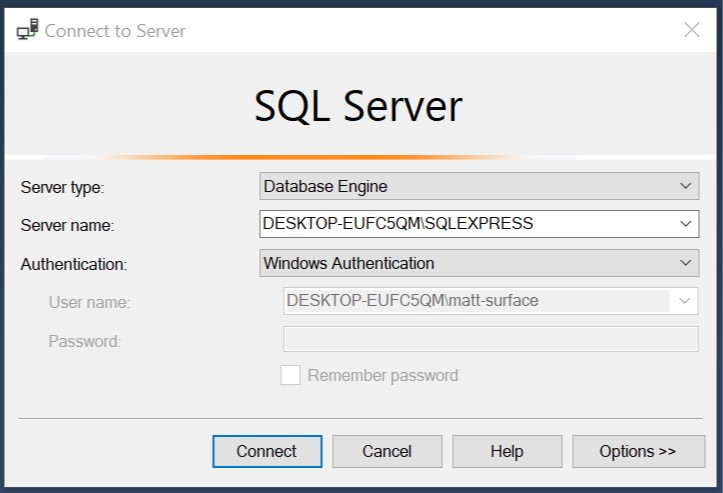
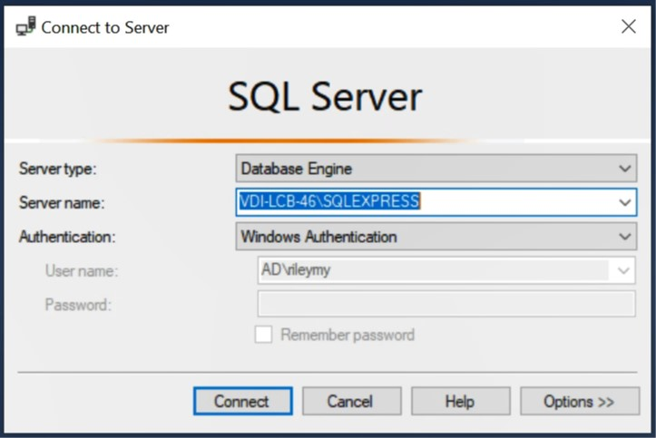

# Install/Run MS SQL Server Express 2017 & SSMS 18.2

*Note: Mac users will need to use a PC/Windows. Lindner has loaner laptops as well as a Virtual Lab. See Option 2 below.*

## Option 1: Local PC

*Recommended if you own a Windows machine.*

1. *Go to next step if you're not using your own PC.*
2. Download [MS SQL Server **Express** 2017](https://www.microsoft.com/en-us/sql-server/sql-server-editions-express)
    + Click "download now."
3. Run and follow these steps:
    + When prompted, select the Basic installation.
    + *Restart may be required.*
    + At end of installation, select "Install SMSS" **OR** [go here](https://docs.microsoft.com/en-us/sql/ssms/download-sql-server-management-studio-ssms?redirectedfrom=MSDN&view=sql-server-2017) to download.
4. Run SMSS Installation from Step 3.
    + *Restart may be required.*
5. Navigate to the SSMS 18 Application. `Start -> Microsoft SQL Server Tools 18 -> SQL Server Management Studio 18`
6. Press connect if you see a similar image below. *Your server name will differ*. Get with me if you can't press connect.

    
 
7. You're in! Congratulations!

## Option 2: UC Virtual Machine (VM) or Loaner Laptop *(Mac Option)*

#### *IMPORTANT: The VM, like a loaner laptop, is not your machine. When working there, you must use OneDrive or your I:/ drive in order to save your work. If you save it elsewhere, you won't be able to access it after you close the connection!!!*

1. If you're off-campus, you'll have to connect to UC's VPN first.
    + *[Instructions](https://kb.uc.edu/KBArticles/VPN-InstallandUse.aspx).
2. Connect to the UC virtual lab through VM Horizon. 
    + *You have to download and set it up on your machine first if you haven't already. Link [for Windows](https://kb.uc.edu/KBArticles/UCVLabs-Windows.aspx) or [for Mac](https://kb.uc.edu/KBArticles/UCVLabs-MacOSX.aspx).*
    + *ucvlabs.uc.edu is the connection server. It's embedded in the instructions.*
4. Select "LCB Student Desktop" as the VM. 
    +*This has changed through time.*</small>
5. SQL Server is installed on the VM. 
    + *There may be small version differences from what we use in class, but they will not impact your work in this course.*
6. Navigate to the SSMS 17 Application. `Start -> Microsoft SQL Server Tools 17 -> SQL Server Management Studio 17` 
    + *This may change to version 18 if it's updated.*
7. Press connect (see image). *Your server name will differ*. 

    

7. You're in! Congratulations!

<!--
## Download and install AdventureWorks

[*AdventureWorks GitHub*](https://github.com/Microsoft/sql-server-samples/blob/master/samples/databases/adventure-works/README.md)

We will **install from a backup**!!! There are multiple options.

1. *Use AdventureWorks 2014.* It is important to ensure that the AdventureWorks version is compatible with the version of SQL Server. The year of AdventureWorks must be less than or equal to the year of SQL Server. No one should run a SQL Server version prior to 2014, so this shouldn't be an issue. AdventureWorks 2014 will work just fine with SQL Server 2017.
-->
