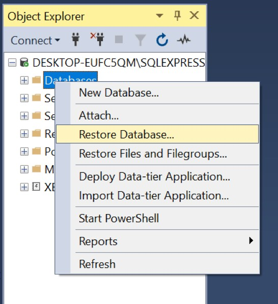
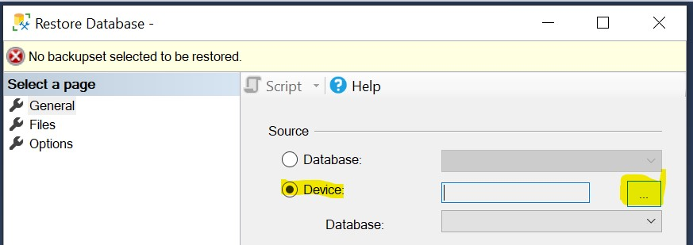
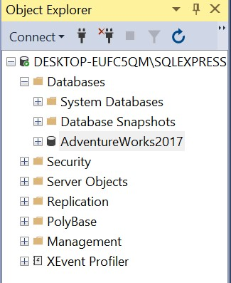

# Set Up AdventureWorks Database

The AdventureWorks database is a sample SQL Server database built and maintained by Microsoft. Built under a relational model, the database is useful to learn the power of the SQL query.

*If you are using a loaner laptop or virtual machine, you will have to repeat these steps. My only recommendation is to place the .bak file in your UC I:/ drive or OneDrive to save you time. However, as noted below, you still have to copy/paste the file to another location.*

## Download AdventureWorks 2017

1. Navigate to the [MS AdventureWorks Github](https://github.com/microsoft/sql-server-samples/releases/tag/adventureworks) site.
2. Navigate to the portion of the site titled: *"AdventureWorks (OLTP) full database backups"*.
3. Click AdventureWorks2017.bak in order to download the back-up file.
4. Save (or copy/paste) the file to:
    + `C:/Program Files` **IF USING YOUR OWN MACHINE**.
    + `C:/users/[username]` **IF USING A UC PC** where [username] is your 6+2 UCID.
    + This is important! SQL Server is very permissions-heavy for a reason, and these locations have been verified by me. There are many locations that *will not work*.

## Restore AdventureWorks 2017

1. Open SSMS and:
    + Press `Connect` **if using your own machine**.
    + Change the server name to `(LocalDB)\MSSQLLOCALDB` **if using a UC PC**. 
2. In the Object Explorer, navigate to the `Databases` node and right-click. Select `Restore Database...`.

    
    
3. Select Device as the Source and click on the ellipses `...` button.

    
    
4. Click `Add`.
5. Depending on whether you are using your own machine or not, navigate to `C:/Program Files/` or `C:/users/[username]` and find the `AdventureWorks2017.bak` file. Add the file.
6. When returned to the main menu, select `OK`.
7. Within the Object Explorer, you should now see AdventureWorks2017 as a node under `Databases`.

    

## Notes
1. *It is important to ensure that the AdventureWorks version is compatible with the version of SQL Server. The year of AdventureWorks should be less than or equal to the year of SQL Server. For example, you can run AdventureWorks2014 from SQL Server 2017. MS generally develops backwards-compatible software (thankfully). No one should be running a SQL Server version prior to 2017, so this shouldn't be an issue.**
